# Entity Relationship Diagram

This ERD is automatically generated from the Prisma schema.

```mermaid
erDiagram

  %% User: 系统用户表
  User {
    id String "PK"
  }

  %% Workspace: 工作空间表
  Workspace {
    id String "PK"
    name String
  }

  %% PaymentUser: 支付用户表
  PaymentUser {
    id String "PK"
    userId String
    email String "UK"
    paymentPlatform PaymentPlatform
    customerId String "OPTIONAL UK"
    payments Payment
    creditRecords CreditRecord
    createdAt DateTime
    updatedAt DateTime
  }

  %% Payment: 支付记录表
  Payment {
    id String "PK"
    amount Float
    currency String
    status PaymentStatus
    paymentPlatform PaymentPlatform
    paymentId String "UK"
    paymentUserId String
    paymentUser PaymentUser
    createdAt DateTime
    updatedAt DateTime
  }

  %% Subscription: 订阅表
  Subscription {
    id String "PK"
    paymentPlatform PaymentPlatform
    subscriptionId String "UK"
    status SubscriptionStatus
    workspaceId String "UK"
    workspace Workspace
    plan PlanType
    startDate DateTime
    endDate DateTime
    createdAt DateTime
    updatedAt DateTime
  }

  %% FeatureUsage: 功能使用情况表
  FeatureUsage {
    id String "PK"
    workspaceId String
    workspace Workspace
    featureCode String
    used Float
    createdAt DateTime
    updatedAt DateTime
    workspaceId_featureCode String "UK"
  }

  %% Credit: 充值余额表
  Credit {
    id String "PK"
    workspaceId String "UK"
    workspace Workspace
    balance Float
    total Float
    totalUsage Float
    createdAt DateTime
    updatedAt DateTime
  }

  %% CreditRecord: 充值记录表
  CreditRecord {
    id String "PK"
    amount Float
    type CreditType
    workspaceId String
    workspace Workspace
    paymentUserId String
    paymentUser PaymentUser
    paymentId String "OPTIONAL UK"
    payment Payment "OPTIONAL"
    description String "OPTIONAL"
    createdAt DateTime
    updatedAt DateTime
  }

  %% CreditUsage: 充值使用记录表
  CreditUsage {
    id String "PK"
    workspaceId String
    workspace Workspace
    featureCode String
    amount Float
    description String
    status UsageStatus
    createdAt DateTime
    updatedAt DateTime
  }

  %% AIUsage: AI 使用记录表
  AIUsage {
    id String "PK"
    workspaceId String
    workspace Workspace
    pageId String
    type AIUsageType
    points Int
    freePoints Int
    description String "OPTIONAL"
    createdAt DateTime
    updatedAt DateTime
    workspaceId_pageId String "UK"
  }

  %% Relationships
  Payment ||--|| PaymentUser : "paymentUser"
  Subscription ||--|| Workspace : "workspace"
  FeatureUsage ||--|| Workspace : "workspace"
  Credit ||--|| Workspace : "workspace"
  CreditRecord ||--|| Workspace : "workspace"
  CreditRecord ||--|| PaymentUser : "paymentUser"
  CreditRecord ||--|| Payment : "payment"
  CreditUsage ||--|| Workspace : "workspace"
  AIUsage ||--|| Workspace : "workspace"

  %% Enums as entities with single field
  PaymentStatus {
    value ENUM "PENDING|SUCCEEDED|FAILED"
  }

  SubscriptionStatus {
    value ENUM "ACTIVE|CANCELED|PAST_DUE|UNPAID|TRIAL"
  }

  PlanType {
    value ENUM "FREE|BASIC|PRO|ENTERPRISE"
  }

  PaymentPlatform {
    value ENUM "STRIPE"
  }

  UsageStatus {
    value ENUM "SUCCEEDED|FAILED|REFUNDED"
  }

  CreditType {
    value ENUM "PURCHASE"
  }

  AIUsageType {
    value ENUM "TEXT_CHAT|IMAGE_GENERATION"
  }


```

## Legend

### Field Attributes

- PK: Primary Key
- UK: Unique Key (including composite unique constraints)
- OPTIONAL: Nullable field

### Relationships

- ||--||: One-to-One
- ||--o{: One-to-Many

### Notes

- Model comments are shown as %% comments
- Enum types are shown as separate entities
- Composite unique constraints are shown as additional fields with "UK" attribute
