# Entity Relationship Diagram

This ERD is automatically generated from the Prisma schema.

```mermaid
erDiagram

  %% User: 系统用户表
  User {
    id String "PK"
  }

  %% Workspace: 工作空间表
  Workspace {
    id String "PK"
    name String
  }

  %% PaymentUser: 支付用户表
  PaymentUser {
    id String "PK"
    userId String
    email String "UK"
    paymentPlatform PaymentPlatform
    customerId String "OPTIONAL UK"
    payments Payment
    credits Credit
    createdAt DateTime
    updatedAt DateTime
  }

  %% Payment: 支付记录表
  Payment {
    id String "PK"
    amount Float
    currency String
    status PaymentStatus
    paymentPlatform PaymentPlatform
    paymentId String "UK"
    paymentUserId String
    paymentUser PaymentUser
    createdAt DateTime
    updatedAt DateTime
  }

  %% Subscription: 订阅表
  Subscription {
    id String "PK"
    paymentPlatform PaymentPlatform
    subscriptionId String "UK"
    status SubscriptionStatus
    workspaceId String "UK"
    workspace Workspace
    plan PlanType
    startDate DateTime
    endDate DateTime
    createdAt DateTime
    updatedAt DateTime
  }

  %% FeatureUsage: 功能使用情况表
  FeatureUsage {
    id String "PK"
    workspaceId String
    workspace Workspace
    featureCode String
    used Float
    createdAt DateTime
    updatedAt DateTime
  }

  %% Credit: 充值余额表
  Credit {
    id String "PK"
    workspaceId String "UK"
    workspace Workspace
    balance Float
    total Float
    totalUsage Float
    createdAt DateTime
    updatedAt DateTime
  }

  %% CreditRecord: 充值记录表
  CreditRecord {
    id String "PK"
    amount Float
    type CreditType
    workspaceId String
    workspace Workspace
    paymentUserId String
    paymentUser PaymentUser
    paymentId String "OPTIONAL UK"
    payment Payment "OPTIONAL"
    description String "OPTIONAL"
    createdAt DateTime
    updatedAt DateTime
  }

  %% CreditUsage: 充值使用记录表
  CreditUsage {
    id String "PK"
    workspaceId String
    workspace Workspace
    featureCode String
    amount Float
    description String
    status UsageStatus
    createdAt DateTime
    updatedAt DateTime
  }

  %% AIUsage: AI 使用记录表
  AIUsage {
    id String "PK"
    workspaceId String
    workspace Workspace
    type AIUsageType
    points Int
    freePoints Int
    paidPoints Int
    pageId String
    description String "OPTIONAL"
    createdAt DateTime
    updatedAt DateTime
  }

  %% Relationships
  Payment }|--|| PaymentUser : "belongs to"
  Subscription }|--|| Workspace : "belongs to"
  FeatureUsage }|--|| Workspace : "belongs to"
  Credit }|--|| Workspace : "belongs to"
  CreditRecord }|--|| Workspace : "belongs to"
  CreditRecord }|--|| PaymentUser : "belongs to"
  CreditRecord }|--o| Payment : "optional payment"
  CreditUsage }|--|| Workspace : "belongs to"
  AIUsage }|--|| Workspace : "belongs to"

  %% Enums as entities
  PaymentStatus {
    status ENUM "PENDING SUCCEEDED FAILED"
  }

  SubscriptionStatus {
    status ENUM "ACTIVE CANCELED PAST_DUE UNPAID TRIAL"
  }

  PlanType {
    plan ENUM "FREE BASIC PRO ENTERPRISE"
  }

  PaymentPlatform {
    platform ENUM "STRIPE"
  }

  UsageStatus {
    status ENUM "SUCCEEDED FAILED REFUNDED"
  }

  CreditType {
    type ENUM "PURCHASE"
  }

  AIUsageType {
    type ENUM "TEXT_CHAT IMAGE_GENERATION"
  }


```

## Legend

### Field Attributes

- PK: Primary Key
- UK: Unique Key
- OPTIONAL: Nullable field

### Relationships

- }|--||: Many-to-One
- }|--o|: Many-to-One (Optional)

### Notes

- Model comments are shown as %% comments
- Enum types are shown as separate entities with their possible values
