# Entity Relationship Diagram

This ERD is automatically generated from the Prisma schema.

```mermaid
erDiagram

  %% User: 系统用户表
  User {
    id String "PK"
  }

  %% Workspace: 工作空间表
  Workspace {
    id String "PK"
    name String
    Subscription Subscription "O"
    FeatureUsage FeatureUsage
    Point Point "O"
  }

  %% PaymentUser: 支付用户表
  PaymentUser {
    id String "PK"
    userId String
    email String "U"
    paymentPlatform PaymentPlatform
    stripeCustomerId String "O U"
    records PaymentRecord
    createdAt DateTime
    updatedAt DateTime
  }

  %% PaymentRecord: 支付记录表
  PaymentRecord {
    id String "PK"
    amount Float
    currency String
    status PaymentStatus
    type PaymentType
    paymentPlatform PaymentPlatform
    stripePaymentId String "U"
    paymentUserId String
    paymentUser PaymentUser
    createdAt DateTime
    updatedAt DateTime
  }

  %% Subscription: 订阅表
  Subscription {
    id String "PK"
    paymentPlatform PaymentPlatform
    stripeSubscriptionId String "U"
    status SubscriptionStatus
    workspaceId String "U"
    workspace Workspace
    plan PlanType
    startDate DateTime
    endDate DateTime
    createdAt DateTime
    updatedAt DateTime
  }

  %% FeatureUsage: 功能使用情况表
  FeatureUsage {
    id String "PK"
    workspaceId String
    workspace Workspace
    featureCode String
    used Float
    createdAt DateTime
    updatedAt DateTime
  }

  %% Point: 积分表
  Point {
    id String "PK"
    workspaceId String "U"
    workspace Workspace
    amount Int
    total Int
    used Int
    records PointRecord
    createdAt DateTime
    updatedAt DateTime
  }

  %% PointRecord: 积分变动记录表
  PointRecord {
    id String "PK"
    pointId String
    point Point
    type PointRecordType
    amount Int
    description String
    createdAt DateTime
    updatedAt DateTime
  }

  %% PagePointUsage: 页面积分使用表
  PagePointUsage {
    id String "PK"
    workspaceId String
    pageId String
    amount Int
    createdAt DateTime
    updatedAt DateTime
  }

  %% Enums
  PaymentType {
    type ENUM "SUBSCRIPTION // 订阅|POINT_PURCHASE // 购买积分"
  }

  PaymentStatus {
    type ENUM "PENDING // 支付待处理|SUCCEEDED // 支付成功|FAILED // 支付失败"
  }

  SubscriptionStatus {
    type ENUM "ACTIVE // 订阅激活中|CANCELED // 订阅已取消|PAST_DUE // 订阅已逾期|UNPAID // 订阅未支付|TRIAL // 试用期"
  }

  PlanType {
    type ENUM "FREE // 免费版计划|BASIC // 基础版计划|PRO // 专业版计划|ENTERPRISE // 企业版计划"
  }

  PaymentPlatform {
    type ENUM "STRIPE // Stripe支付平台"
  }

  PointRecordType {
    type ENUM "PURCHASE // 购买积分|CONSUMPTION // 消费积分|REWARD // 奖励积分"
  }


```

## Legend

### Field Attributes
- PK: Primary Key
- U: Unique
- O: Optional (Nullable)
- D: Default Value

### Relationships
- ||--||: One-to-One
- ||--o{: One-to-Many

### Notes
- Model comments are shown as %% comments
- Enum types are shown as separate entities
