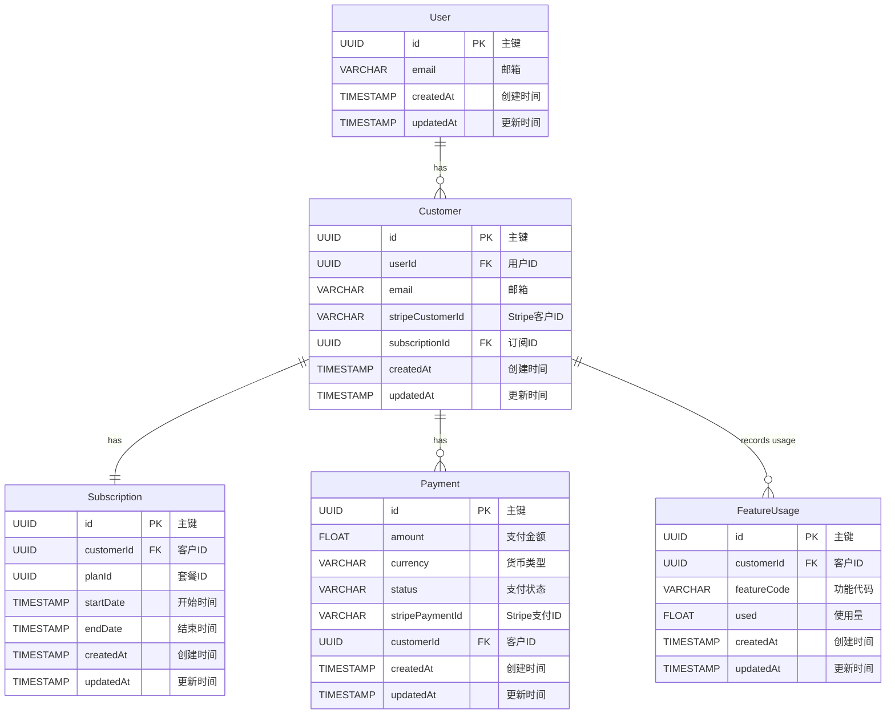

# Entity Relationship Diagram

This ERD is automatically generated from the MySQL schema.

## Legend

### Field Types

- UUID: Universally Unique Identifier
- VARCHAR: Variable-length character string
- TIMESTAMP: Date and time
- FLOAT: Floating-point number

### Field Attributes

- PK: Primary Key
- FK: Foreign Key

### Relationships

- ||--||: One-to-One
- ||--o{: One-to-Many

### Notes

- All tables include created_at and updated_at timestamps for auditing
- UUID is used as the primary key type across all tables
- Foreign keys maintain referential integrity between tables

